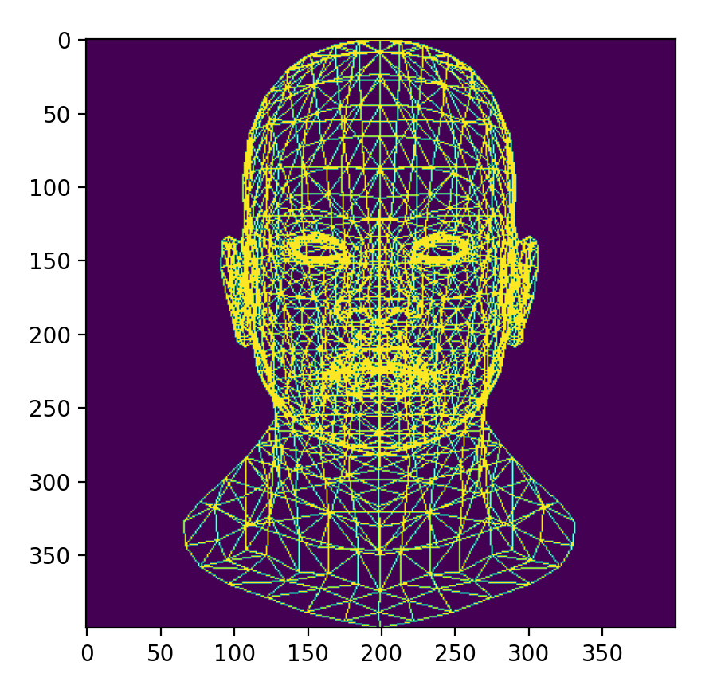
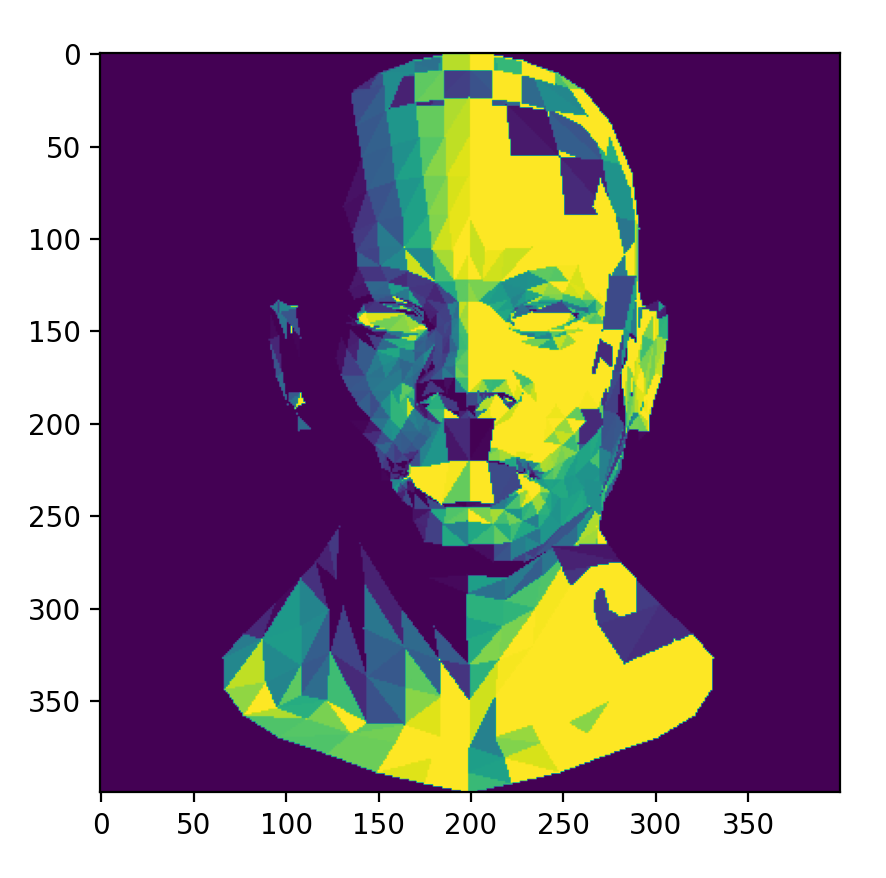
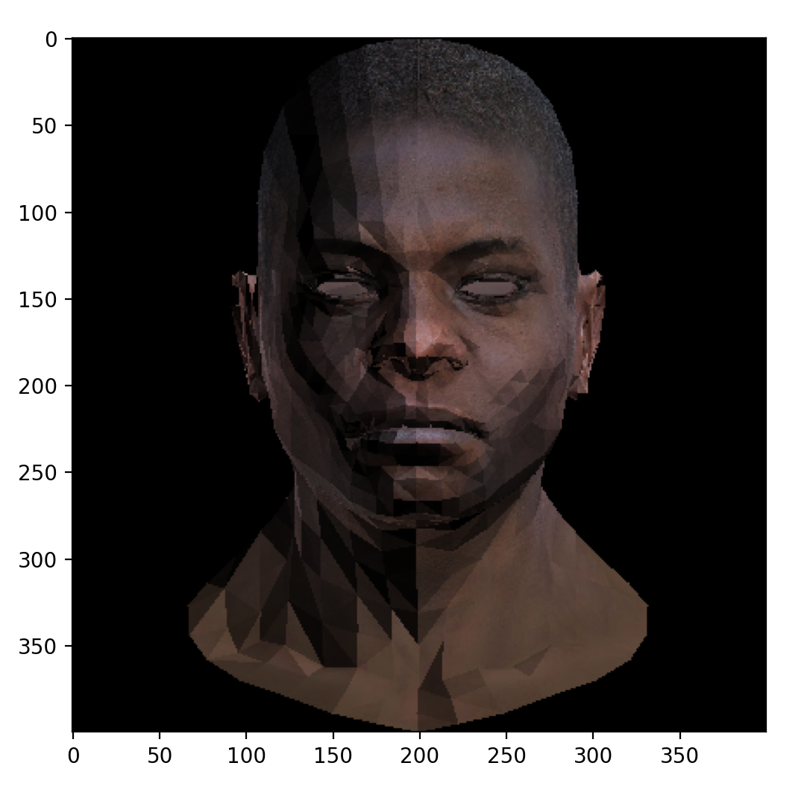

based on tutorial: https://github.com/ssloy/tinyrenderer

* **lab1** - only lines, Z axis dropped, Bresenham Algorithm

* **lab2** - triangles rendering, only convex surfaces

* **lab3** - convex and concave surfaces, UV texture application

